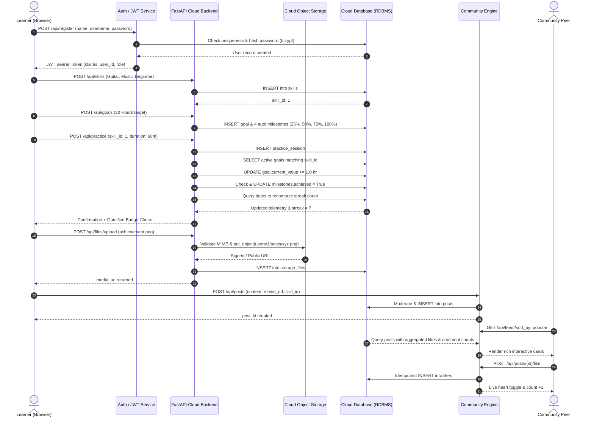

# Cloud Architecture & System Design

## 1. High-Level Architecture Overview

The **Online Hobby & Skills Tracker with Community Sharing on Cloud** is designed following the **Decoupled 3-Tier Cloud Native Architecture Pattern**:

```
                       +----------------------------------+
                       |           End Users              |
                       | (Laptops, Tablets, Smartphones)  |
                       +-----------------+----------------+
                                         | HTTPS (TLS 1.3)
                                         v
                       +----------------------------------+
                       |    Cloudflare CDN / Edge Cache   |
                       +-----------------+----------------+
                                         |
                  +----------------------+----------------------+
                  |                                             |
                  v                                             v
    +---------------------------+                 +---------------------------+
    |     Vite + React SPA      |                 |    Cloud API Gateway      |
    |  (Static Web App Storage) |                 | (Reverse Proxy / Routing) |
    +---------------------------+                 +-------------+-------------+
                                                                |
                                                                v
                                                  +---------------------------+
                                                  | FastAPI Backend Services  |
                                                  |   (Container / Run)       |
                                                  +-------------+-------------+
                                                                |
         +------------------------------------------------------+---------------------------------+
         |                                                      |                                 |
         v                                                      v                                 v
+------------------+                                  +-------------------+              +------------------+
| Cloud Auth / IAM |                                  | Cloud Relational  |              |   Cloud Object   |
|   (JWT / OAuth2) |                                  |  Database (RDBMS) |              |  Storage (S3 /   |
|                  |                                  | (Cloud SQL / PG)  |              | Supabase / Local)|
+------------------+                                  +-------------------+              +------------------+
         |                                                      |                                 |
         | User Claims                                          | Normalized Entities             | Media / Proof
         v                                                      v                                 v
+------------------+                                  +-------------------+              +------------------+
| Stateful Session |                                  |  8 Entity Tables  |              | Signed URLs &    |
|   Verification   |                                  | (Users, Skills,   |              | Key Hierarchies  |
|                  |                                  | Sessions, Feed)   |              |                  |
+------------------+                                  +-------------------+              +------------------+
```

---

## 2. Component Breakdown

### 2.1 Presentation Tier (Frontend Client)
- **Framework**: React 18 + Vite (SPA)
- **Styling**: Modern Tailwind-compatible Glassmorphism CSS with vibrant category gradients.
- **State Management**: React Context (`AuthContext`) handling token persistence, profile state, and session auto-restoration.
- **Networking**: Asynchronous `fetch` client with interceptors for `Authorization: Bearer <token>` injection and unified error unwrapping.

### 2.2 Application Tier (Backend Microservice)
- **Framework**: Python 3.11+ / FastAPI
- **Protocol**: RESTful HTTP/JSON with OpenAPI v3 Swagger autogeneration.
- **Middleware**:
  - CORS middleware allowing cross-origin requests from authenticated client domains.
  - JWT Bearer authentication middleware decoding token claims (`user_id`, `role`, `exp`).
  - Static file server mounting cloud object storage buckets.
- **Services Engine**:
  - `StreakService`: Computes consecutive calendar active days.
  - `GoalProgressService`: Synchronizes practice hours, computes progress percentages, and auto-unlocks milestones.
  - `ContentModerationService`: Implements XSS tag stripping and profanity filtering.
  - `ProgressAnalyticsService`: Aggregates weekly trends, skill distribution, and gamified badges.

### 2.3 Persistence Tier (Cloud Database & Storage)
- **Database Engine**: SQLAlchemy 2.0 ORM with multi-dialect support (SQLite for local rapid testing, PostgreSQL / Google Cloud SQL / Supabase for enterprise deployment).
- **Cloud Object Storage Provider**:
  - Local simulated S3/Blob storage with directory tree `users/{user_id}/{category}/{uuid}.ext`.
  - AWS S3 or Supabase Storage adapters with pre-signed URL capabilities for secure private asset delivery.

---

## 3. Entity-Relationship (ER) Schema Design

```
+---------------------------------------------------------------------------------+
|                                 DATABASE SCHEMA                                 |
+---------------------------------------------------------------------------------+

  +-------------------+       1:N       +-----------------------+
  |       USERS       |----------------<|        SKILLS         |
  +-------------------+                 +-----------------------+
  | PK  user_id       |                 | PK  skill_id          |
  |     name          |                 | FK  user_id           |
  |     username (UQ) |                 |     skill_name        |
  |     email (UQ)    |                 |     category          |
  |     password_hash |                 |     current_level     |
  |     profile_pic   |                 |     target_level      |
  |     bio           |                 |     status            |
  |     interests     |                 |     created_at        |
  |     role          |                 +-----------+-----------+
  |     created_at    |                             |
  +---------+---------+                             | 1:N
            |                                       v
            | 1:N                       +-----------------------+
            +--------------------------<|         GOALS         |
            |                           +-----------------------+
            |                           | PK  goal_id           |
            |                           | FK  user_id           |
            |                           | FK  skill_id          |
            |                           |     title             |
            |                           |     target_value      |
            |                           |     current_value     |
            |                           |     unit              |
            |                           |     deadline          |
            |                           |     status            |
            |                           +-----------+-----------+
            |                                       | 1:N
            |                                       v
            |                           +-----------------------+
            |                           |      MILESTONES       |
            |                           +-----------------------+
            |                           | PK  milestone_id      |
            |                           | FK  goal_id           |
            |                           |     title             |
            |                           |     target_value      |
            |                           |     achieved (bool)   |
            |                           |     achieved_at       |
            |                           +-----------------------+
            | 1:N
            +--------------------------<+-----------------------+
            |                           |   PRACTICE_SESSIONS   |
            |                           +-----------------------+
            |                           | PK  session_id        |
            |                           | FK  user_id           |
            |                           | FK  skill_id          |
            |                           |     duration_minutes  |
            |                           |     activity          |
            |                           |     notes             |
            |                           |     practiced_at      |
            |                           +-----------------------+
            | 1:N
            +--------------------------<+-----------------------+
            |                           |         POSTS         |
            |                           +-----------------------+
            |                           | PK  post_id           |
            |                           | FK  user_id           |
            |                           | FK  skill_id (opt)    |
            |                           |     content           |
            |                           |     media_url         |
            |                           |     created_at        |
            |                           +-----------+-----------+
            |                                       |
            | 1:N                                   | 1:N
            +-------+-------------------------------+-------+
            |       |                               |       |
            v       v                               v       v
   +------------+ +------------+          +------------+ +------------+
   |   LIKES    | |  COMMENTS  |          |   LIKES    | |  COMMENTS  |
   +------------+ +------------+          +------------+ +------------+
   | PK like_id | |PK comment_id          | PK like_id | |PK comment_id
   | FK user_id | |FK user_id  |          | FK post_id | |FK post_id  |
   | FK post_id | |FK post_id  |          +------------+ +------------+
   +------------+ |   content  |
                  |   created_at
                  +------------+
```

---

## 4. Cloud Data Flow Lifecycle


